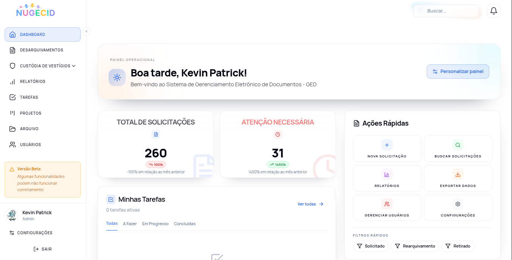

# Nugecid

Sistema de gestão de documentos e desarquivamentos da Polícia Científica do Rio Grande do Norte.

O projeto combina backend NestJS, frontend React/Vite e uma stack Docker com PostgreSQL e Redis para operar os fluxos internos do NUGECID.

## Principais Recursos

- Gestão de desarquivamentos, anexos, termos e relatórios.
- Dashboard com estatísticas operacionais.
- Kanban de tarefas, projetos, checklists e comentários.
- Gestão de usuários, perfis de acesso e auditoria.
- Backup, restauração e verificações de saúde da aplicação.
- Notificações, busca unificada e integrações de apoio.

## Tecnologias

| Camada | Stack |
| --- | --- |
| Backend | NestJS, TypeScript, TypeORM |
| Frontend | React, Vite, TypeScript, TailwindCSS |
| Banco | PostgreSQL |
| Cache / sessões | Redis |
| Infra | Docker Compose, Nginx |
| Testes | Jest, Vitest, Testing Library, Playwright |

## Imagens do Sistema

Para exibir prints do programa aqui no GitHub:

1. Salve as imagens em `docs/screenshots/`.
2. Use nomes simples, sem espaços, por exemplo `dashboard.png`, `desarquivamentos.png` e `kanban.png`.
3. Adicione no README usando Markdown:

```md



```

Sugestão de organização:

| Tela | Arquivo sugerido |
| --- | --- |
| Dashboard inicial | `docs/screenshots/dashboard.png` |
| Lista de desarquivamentos | `docs/screenshots/desarquivamentos.png` |
| Detalhe do desarquivamento | `docs/screenshots/detalhe-desarquivamento.png` |
| Kanban de tarefas | `docs/screenshots/kanban.png` |
| Relatórios / estatísticas | `docs/screenshots/relatorios.png` |

## Como Executar

```bash
git clone https://github.com/kevintestegit/Nugecid.git
cd Nugecid
cp .env.example .env
docker compose up -d --build
```

Serviços padrão:

- Frontend: `http://localhost:3001`
- Backend/API: `http://localhost:8080`
- Adminer: `http://localhost:8081`
- Health: `http://localhost:8080/health`
- Readiness: `http://localhost:8080/ready`

## Desenvolvimento Local

```bash
npm install
cd frontend && npm install && cd ..
docker compose up -d db redis
npm run migration:run
npm run dev
```

## Comandos Úteis

| Comando | Descrição |
| --- | --- |
| `npm run dev` | Inicia backend e frontend em modo desenvolvimento |
| `npm run build` | Gera build de produção |
| `npm run test:unit` | Executa testes unitários |
| `npm run typecheck` | Verifica tipos TypeScript |
| `npm run lint` | Executa lint |
| `npm run migration:run` | Aplica migrations pendentes |
| `npm run system:check` | Verifica containers e endpoints principais |
| `npm run smoke:test` | Roda smoke test pós-deploy |

## Estrutura

```text
.
├── src/                 # Backend NestJS
├── frontend/            # Frontend React/Vite
├── docker/              # Arquivos auxiliares de infraestrutura
├── docs/                # Documentação e imagens
├── scripts/             # Scripts operacionais
├── docker-compose.yml   # Stack principal
└── .env.example         # Exemplo de configuração
```

## Documentação Complementar

- [Runbook de deploy](docs/operations/DEPLOY-RUNBOOK.md)
- [Metabase](docs/metabase.md)
- [Roadmap técnico](docs/technical/ROADMAP-MELHORIAS.md)
- [Matriz de exposição de rotas](docs/security/MATRIZ-EXPOSICAO-ROTAS.md)

## Licença

Projeto proprietário desenvolvido para uso institucional da Polícia Científica do Rio Grande do Norte.
